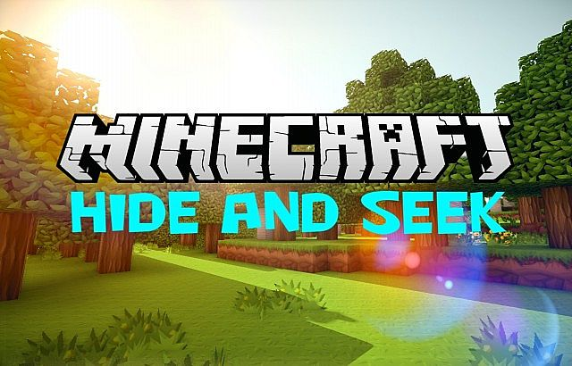

  

# Welcome 
Welcome to our project page. This is a project for UCI's CS 175 - Project in AI. In this class we are utilizing Microsoft's [Project Malmo](https://www.microsoft.com/en-us/research/project/project-malmo/) experimentation platform to tinker with artificial intelligence models in Minecraft.

# Project overview
Our project creates an environment for two separate reinforcement learning agents to compete against one another in a game of hide and seek. As we pit the agents against one another we hope to discover emerging strategies and counter-strategies that the agents employ to achieve their own separate goals. Various links about our project can be found at the top of the page.
