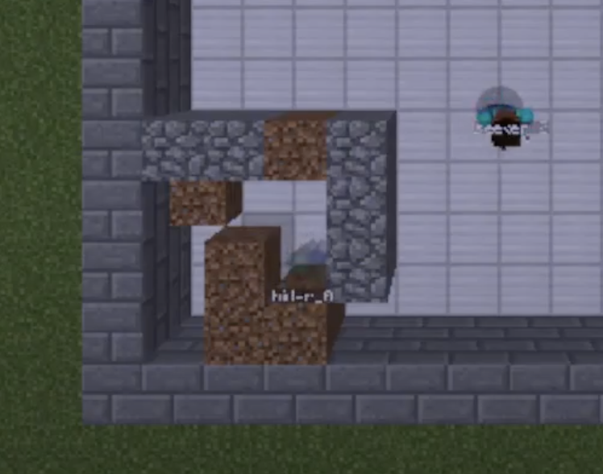

# Video Summary

  <iframe width="560" height="315" src="https://www.youtube.com/embed/ytsXH7dT1Ls" frameborder="0" allow="accelerometer; autoplay;clipboard-write; encrypted-media; gyroscope; picture-in-picture" allowfullscreen></iframe>

# Project Summary
Our goal is to create an emergent environment where one or more hiders use dirt blocks to hide themselves from one or more seekers in an enclosed arena, to which the seekers can use shovels to dig the dirt to find the hiders. The hiders go first and have a defined period of time to hide themselves in the arena. The seekers go second and have a defined period of time to point their cursor at a hider. 

# Approach
Initially, we designed a multi-agent environment that had both teams operating simultaneously in a vectorized manner, managed by a single Advantage Actor Critic algorithm. The Stable Baselines 3 A2C algorithm could handle multiple environments with a single model and continuous action spaces, so we thought it’d be a good fit. However, although the algorithm could pilot both the hiders and seekers, we realized after analyzing the rewards and the behavior afterward that the agents would give the model contradictory rewards. We assumed this made it impossible for the model to converge on a solution.   
In order to address this issue of contradictory rewards, we restructured the training environment so that separate models managed the hider and seeker teams. Both teams received a single Soft Actor Critic model. At this stage in development, we decided on using a single agent for each model, meaning that the system no longer operates in a multi-agent way. To simplify the environment, each agent would operate sequentially instead of simultaneously, more akin to a turn-based game of hide-and-seek than a real-time game of tag. The hider agent would go first, equipped with dirt blocks to make it more difficult for the seeker agent to find it. When the hider finishes its “turn,” the hider Soft Actor Critic immediately ends its episode and waits until the seeker Soft Actor Critic finishes its own episode, to which it calls its reset and restarts the mission.   
Observation spaces are set using Gym’s Dict Space. Within this Dict Space is an attribute for “facing,” where a pair of values describes the direction that the agent is facing in degrees in two dimensions. The second attribute is “grid,” where the agent is given an observation box only for blocks. No entities are detected in the “grid” attribute, meaning that seekers will never precisely know the location of the hider until it scans for it with its cursor and receives a reward. The size of this grid for our video was 3 blocks in any direction. We gave it a wider observation space in an effort to get higher rates of improvement.  
Rewards are given as follows: if a ray shot out from the center of the seeker’s viewport collides with a hider’s hitbox, the seeker is given 5 points for its turn. Additional points are not given for more collisions afterward; the environment must reset before more points can be given. Similarly, if a hider is “found” in this way, it loses 5 points for its turn. To encourage productive camera movement, both the hider and seeker are penalized 1 point if the raycast from its cursor does not collide with anything; this only happens if the agent is looking away from the arena and into the sky.  
The reason for the sky-looking penalty is because of the action-space: we allow the agent to look with pitch in addition to yaw because we believed that this gave the hider greater agency in where it could put its blocks. Blocks on the higher layers block the seeker’s sightlines and restricting block-placement on the ground level wouldn’t be productive to the hider’s mission apart from hindering the seeker’s movement.  

# Evaluation
We evaluated the project by using a top down view through an observation agent that allows us to clearly see how the agents are moving and responding, along with any possible routes that either the seeker or hider can take to evaluate the effectiveness of their learning.

In our current iteration of the project, we utilized a simple reward system:

| Seeker Action                               | Reward |
|---------------------------------------------|--------|
| Staring at sky                              | - 1    |
| Catching hider (cursor collides with hider) | + 5    |

| Seeker Action                               | Reward |
|---------------------------------------------|--------|
| Staring at sky                              | - 1    |
| Catching hider (cursor collides with hider) | + 5    |

Using this reward policy of +5 or -5 for the respective agents, the hider was able to effectively learn to how to avoid getting caught as long as possible and the seeker was able to learn tactics to quickly search the entire arena for the hider. However, the hider agent was able to improve faster than the seeker agent and learned to place dirt blocks at the open door locations in order to block themselves off into a subsection of the arena so the seeker could not reach them. The seeker was provided a shovel that allowed them to break the dirt blocks, but they struggled to figure out to achieve that in order to reach the blocked off hider. 

  

Lastly, after evaluating the reinforcement learning for both agents, the staring at the sky penalty was included because we realized that we wanted to discourage the agents from observing unimportant areas outside of the mission space in order to streamline the learning process.

# Remaining Goals and Challenges

One of the remaining goals and challenges for our model is implementing the actual multi-agent aspect. Although our current iteration of this project is simply in the proof of concept stage for multi-agent reinforcement learning, we are confident that it is something achievable with Malmo. Currently we have the project set up in such a way that one agent will train until the mission ends, and subsequently, the second agent will begin training. This continues alternating back and forth so essentially, only one agent is actually training and learning at a time while the other does nothing in order to prevent the hider’s and seeker’s rewards from contradicting each other. However, we believe we will be able to just take the two respective agents and dump them into the multi-agent framework so they can both run concurrently while avoiding the issue with the contradictory rewards. After tinkering with the framework for some time, we do not anticipate that this challenge will cause too many issues and is definitely a goal that can feasibly be achieved by the final report. 

Another goal that we had in mind for this project was to incorporate multiple agents for both the seekers and hiders. Currently, we are only limiting our scope to one seeker and one hider in order to simplify and streamline the implementation process. After we are able to get the previous goal of having the seeker and hider train simultaneously through separate models, we can begin looking into expanding and tinkering with the number of agents hiding and number of agents seeking for a mission. If either the seekers or the hiders are not having much success with the reinforcement learning, we can tweak the number of hiders or seekers available in the mission to make the task harder or easier and help guide the learning process in the right direction. 

# Resources Used
Key resources used in this project include:

Stable Baselines 3 Repository, especially A2C, SAC, and VecEnv:
https://github.com/DLR-RM/stable-baselines3

Stable Baselines 3 Documentation Site:
https://stable-baselines3.readthedocs.io/en/master/

Malmo’s Mission Handler Schema Documentation: 
https://microsoft.github.io/malmo/0.21.0/Schemas/MissionHandlers.html

Inspiration for Project, Open AI’s Hide and Seek Emergent MARL:
https://www.youtube.com/watch?v=kopoLzvh5jY
https://openai.com/blog/emergent-tool-use/

